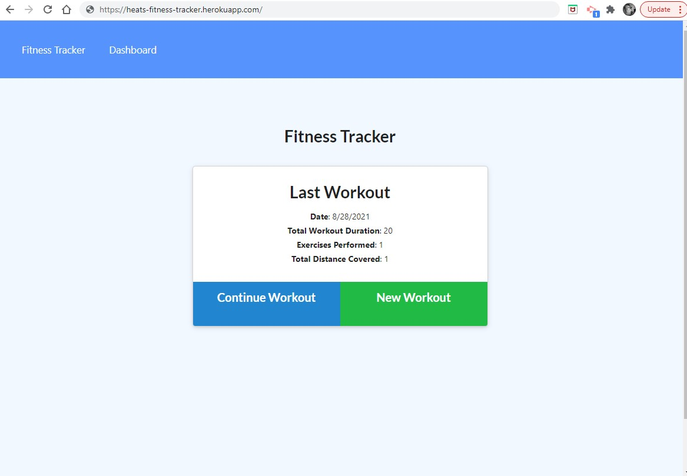

# fitnessTracker
Because working out is the best way to control your anger. 

  ## Table of Contents
  * [The Assignment](##Assignment)
  * [Link](#link)
  * [Comments](#comments)
  * [Technologies](#technologies)
  * [Questions](#questions) 
  * [License](#license)

## Assignment

## The Results

## Link to Demo 

https://heats-tech-blog.herokuapp.com/

## Comments 
This was a little pesky fella. It was a start to finish project that will continue to be an on going project. There is major room for growth, but the base and the start is there. 

I'm amazed at the things I learned along the road to completing this assignment. I started out completely confused on how to use merge the use of Modals and APIs and the idea of intertwining them with Handlebars, sigh. That's how I felt. Sad. But in the end I completed it, and I'm happy with that. It's amazing what happens when you have the focus. 

## Technologies
- JavaScript
- MongoDB
- Node.js
- npm
    - express
    - mongoose

## Contact Information 

### Heather Bjoin 

  ### For any questions or comments feel free to contact me by using the email below.
  
  <a href="mailto:h.m.bjoin@gmail.com">Email</a>

  ### To see more of my projects: 

  <a href="https://github.com/HeatMarie">Github</a>

## License
  
  
                MIT License

          Copyright (c) 2021, Heather Bjoin

          Permission is hereby granted, free of charge, to any person obtaining a copy
          of this software and associated documentation files (the "Software"), to deal
          in the Software without restriction, including without limitation the rights
          to use, copy, modify, merge, publish, distribute, sublicense, and/or sell
          copies of the Software, and to permit persons to whom the Software is
          furnished to do so, subject to the following conditions:

          The above copyright notice and this permission notice shall be included in all
          copies or substantial portions of the Software.

          THE SOFTWARE IS PROVIDED "AS IS", WITHOUT WARRANTY OF ANY KIND, EXPRESS OR
          IMPLIED, INCLUDING BUT NOT LIMITED TO THE WARRANTIES OF MERCHANTABILITY,
          FITNESS FOR A PARTICULAR PURPOSE AND NONINFRINGEMENT. IN NO EVENT SHALL THE
          AUTHORS OR COPYRIGHT HOLDERS BE LIABLE FOR ANY CLAIM, DAMAGES OR OTHER
          LIABILITY, WHETHER IN AN ACTION OF CONTRACT, TORT OR OTHERWISE, ARISING FROM,
          OUT OF OR IN CONNECTION WITH THE SOFTWARE OR THE USE OR OTHER DEALINGS IN THE
          SOFTWARE.

